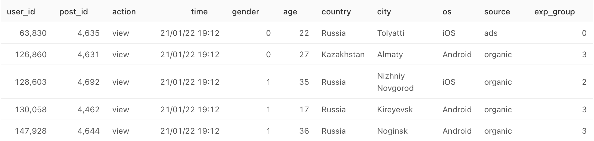
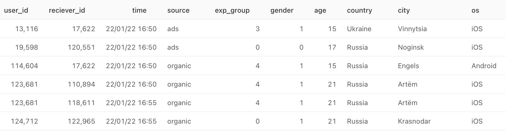

# Analysis of the Social network

In this repo I analyzed the syntetic start-up social network, wich has <b>messenger and feed news</b>.
All work was did remotely in GitLab, JupiterHub, Superset, ClickHouse, Redash.

## The main tasks were:
### 1. Create 3 dashboards in Superset : 
    - Feed news dashboard (DAU, WAU, MAU, likes, views, CTR, Retention, Weekly audience,location, operational system, source of the trafic).
    - Operational data dashboard (active users today).
    - Crossing news feed and messenger dashboard.
files: news_feed.jpg, news_feed_operational_data.jpg, news_feed_messages.jpg
    
    
### 2. Automatization of the daily reporting:
    - Creating the bot in Telegram.
    - Automatic report sending to the bot and creating schedule time to send message.  
    - Automatization in Gitlab CI/CD.
    - Storage the token of the bot in the secret.
files: auto_report_HW1.py, auto_report_HW2.py

### 3. Anomaly detection
    - Anomaly detection by statistical methods (sigma laws, IQR).
    - Creating auto-checking the anomalies scrypt.      
    - Sending the alert message to the chat in telegram in case of detection the anomaly.
file: anomaly_detector.py

### 4. A/B tests
    - Creating the splitting system for A/B tests.  
    - A/A testing.   AA_test_3_4.ipynb
    - Time and sample size for the A/B experiments. 
files: AA_test_3_4.ipynb, AB_test_CTR_0_1-Copy1.ipynb, A_B_test_analysis.ipynb
    
    
___

## Details
There were two databases:
1. feed_news db  – all activity in news feed
2. messenger db  – all activity in the messenger 

#### **1. News feed database**

`user_id` - unique number of the user.    
`post_id` - unique number of the post.    
`action`  - action, user did, when he was watching the post.  It could be *view* or *like*.  
`time`    - time, user did action.  
`gender`  - gender of the user. It could be *0 - female*, *1 - male*.  
`age`     - age of the user.  
`country` - country of the user.  
`city`    - city of the user.  
`os`      - operational system of the mobile phone of the user. It could be *iOS* or *Android*.  
`source`  - the source the user joined the news feed service. It could be *ads* or *organic*.  
`exp_group` - Random splitting system for A/B tests. There are 5 groups from *0 to 5*.
  
  

#### **2. Messenger database**

`user_id` - unique number of the user.  
`reciever_id` - *user_id* whom was sent the message.  
`time`    - time, user did action.  
`source`  - the source the user joined the news feed service. It could be *ads* or *organic*.  
`exp_group` - Random splitting system for A/B tests. There are 5 groups from *0 to 5*.  
`gender`  - gender of the user. It could be *0 - female*, *1 - male*.  
`age`     - age of the user.   
`country` - country of the user.    
`city`    - city of the user.  
`os`      - operational system of the mobile phone of the user. It could be *iOS* or *Android*.  

